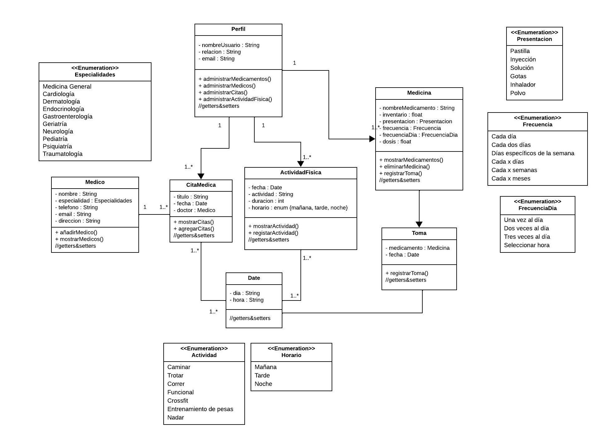

# Proyecto Primer Parcial POO

## Descripción
El proyecto consiste en un programa que permite a los usuarios:  
- Gestionar sus citas médicas.
- Llevar control de sus medicamentos.
- Supervisar su actividad física.

#### Integrantes:
- German Soledispa
- Xavier Guzman
- Christian Zavala

#### Diagrama UML:

**Clona el proyecto con el siguiente comando**:

git clone https://github.com/xavguz/POO-P3-G05.git
