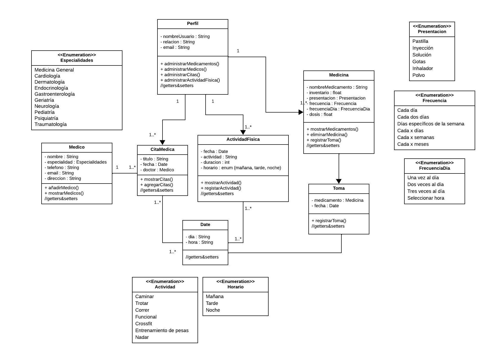

# **Gestor de Medicina y Actividad Física**
## **Descripcion**
Aplicacion para mantener un control de nuestros medicamentos, ofreciendo
diferentes funciones. Control de nuestras actividades fisicas, para mantener 
un estilo de vida mas saludable.

## **Diagrama UML**

### **Instalacion**
git clone https://github.com/xavguz/POO-P3-G05.git

### **Integrantes**
- Xavier Guzman
- German Soledispa
- Christian Zavala
